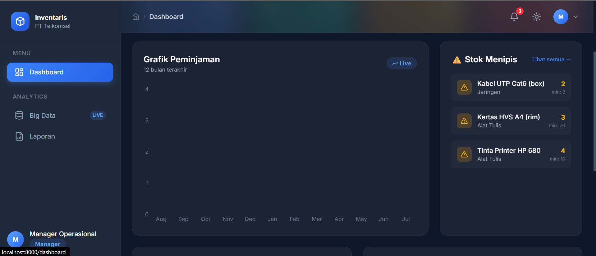
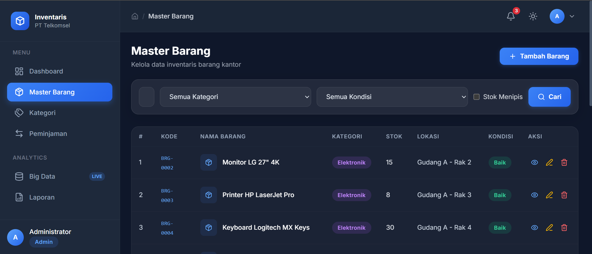
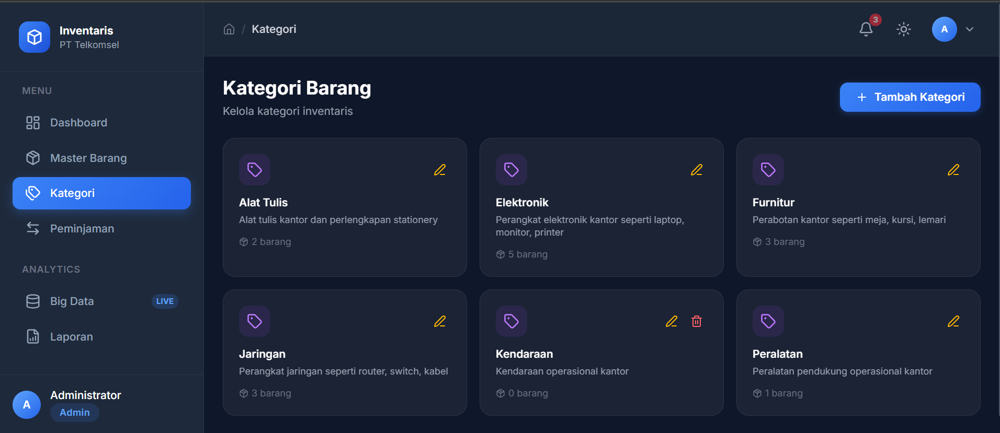
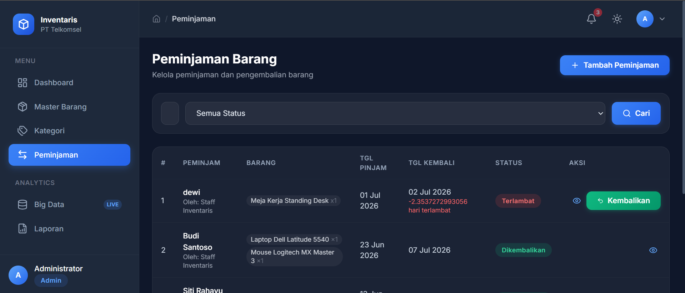
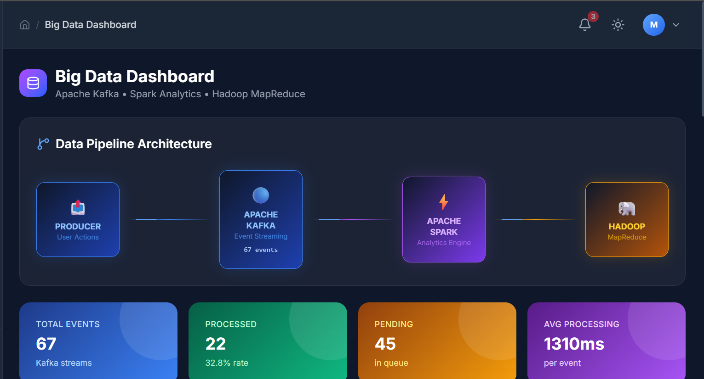
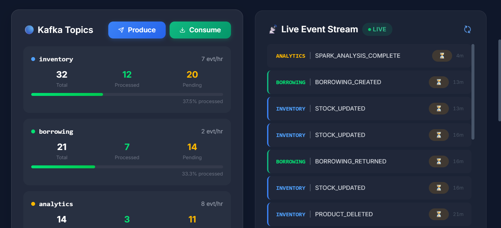
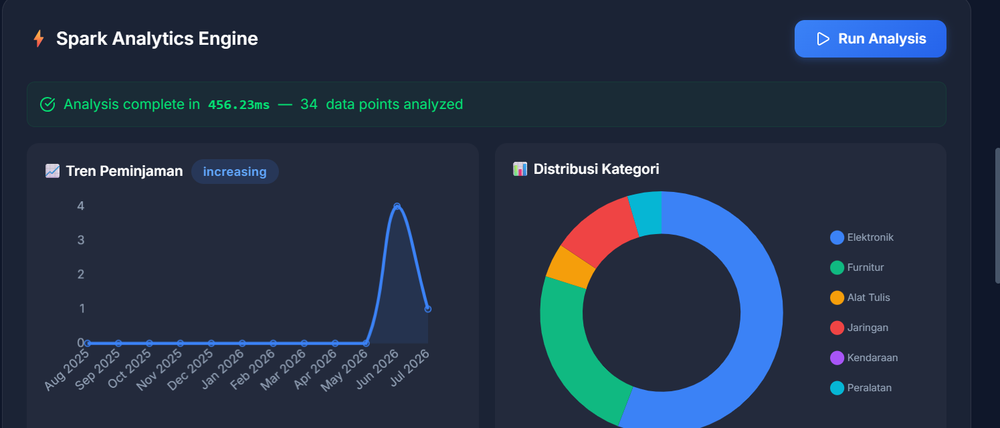
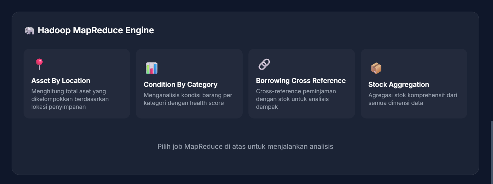
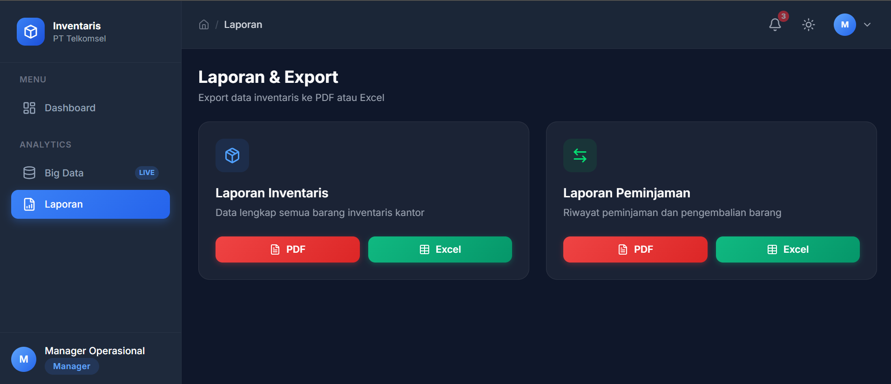

# Sistem Manajemen Inventaris PT Telkomsel & Big Data Simulator

Aplikasi Prototype Manajemen Inventaris Kantor PT Telkomsel yang dibangun menggunakan **Laravel 11**, **Tailwind CSS 4**, dan **PostgreSQL/SQLite**, serta dilengkapi **Simulasi Pipeline Big Data (Apache Kafka, Apache Spark, & Hadoop MapReduce)**.

---

## 📸 Tampilan Antarmuka Aplikasi

### 1. Dashboard Utama
Menampilkan metrik stok barang, status peminjaman aktif, grafik tren peminjaman bulanan menggunakan Chart.js, serta daftar barang dengan stok menipis secara visual.


### 2. Master Barang & Kategori (CRUD)
Mengelola inventaris kantor dengan kode barang unik otomatis, upload gambar barang, filter kategori, kondisi, dan status stok.



### 3. Peminjaman & Pengembalian
Pencatatan peminjaman multi-item otomatis terintegrasi dengan pembaruan stok. Menyediakan sistem pengembalian barang beserta pencatatan kondisi terkini (baik/rusak).


### 4. Big Data Dashboard & Live Event Stream
Visualisasi arsitektur pengolahan data terdistribusi terintegrasi.





### 5. Laporan & Export
Menu export data barang inventaris dan data peminjaman ke format PDF (Landscape) & Excel.


---

## 📥 Panduan Instalasi & Menjalankan (Lokal)

Ikuti langkah-langkah di bawah ini di terminal WSL / Linux Anda:

### 1. Clone & Install Dependensi
```bash
git clone <repository-url>
cd inventaris-telkomsel
composer install
npm install
```

### 2. Konfigurasi Environment & SQLite WSL
Gunakan database SQLite di folder native WSL `/tmp` untuk menghindari error penguncian file (*disk I/O error*) pada WSL:
```bash
# Salin konfigurasi env
cp .env.example .env

# Buat file database kosong di direktori /tmp WSL
touch /tmp/inventaris_telkomsel.sqlite
```
Buka file `.env` di text editor Anda, lalu sesuaikan bagian database:
```env
DB_CONNECTION=sqlite
DB_DATABASE=/tmp/inventaris_telkomsel.sqlite
SESSION_DRIVER=file
CACHE_STORE=file
```

### 3. Migrasi, Seeding & Pemetaan Gambar (Storage Link)
Jalankan perintah ini untuk mengisi database dan menghubungkan folder upload gambar ke folder public:
```bash
# Set key pengaman aplikasi
php artisan key:generate

# Bersihkan config cache
php artisan config:clear

# Jalankan migrasi dan isi data awal seeder
php artisan migrate:fresh --seed

# BUAT SYMLINK (WAJIB agar gambar yang diupload di public/storage dapat tampil di web)
php artisan storage:link
```

### 4. Jalankan Aplikasi
Jalankan compiler aset Vite dan web server Laravel (gunakan dua terminal terpisah):
```bash
# Terminal 1: Compile asset CSS & JS
npm run dev

# Terminal 2: Jalankan web server lokal
php artisan serve
```
Akses aplikasi melalui browser di: **`http://127.0.0.1:8000`**

### 🔑 Kredensial Login Demo
- **Admin**: `admin@telkomsel.co.id` | password: `password`
- **Staff**: `staff@telkomsel.co.id` | password: `password`
- **Manager**: `manager@telkomsel.co.id` | password: `password`

---

## 🛠️ Panduan Pemecahan Masalah (Troubleshooting)

### 1. Error: `could not find driver (Connection: sqlite)`
* **Penyebab**: Ekstensi PHP SQLite belum terinstall di WSL Anda.
* **Solusi**: Jalankan perintah berikut di terminal WSL:
  ```bash
  sudo apt-get update
  sudo apt-get install php-sqlite3 php-xml php-curl php-zip php-gd php-pgsql -y
  ```

### 2. Error: `General error: 10 disk I/O error`
* **Penyebab**: File SQLite diletakkan di partisi Windows `/mnt/c/` yang di-mount ke WSL, sehingga sistem file Windows menolak mekanisme locking file SQLite.
* **Solusi**: Pastikan file database berada di file system native WSL, yaitu `/tmp/inventaris_telkomsel.sqlite` seperti langkah instalasi di atas.

### 3. Error: `419 Page Expired`
* **Penyebab**: Terjadi pergantian session driver atau token keamanan CSRF kedaluwarsa setelah database di-reset.
* **Solusi**: Jalankan `php artisan config:clear`, lalu lakukan **Refresh (F5)** halaman browser Anda secara penuh sebelum menekan tombol Submit/Login kembali.

